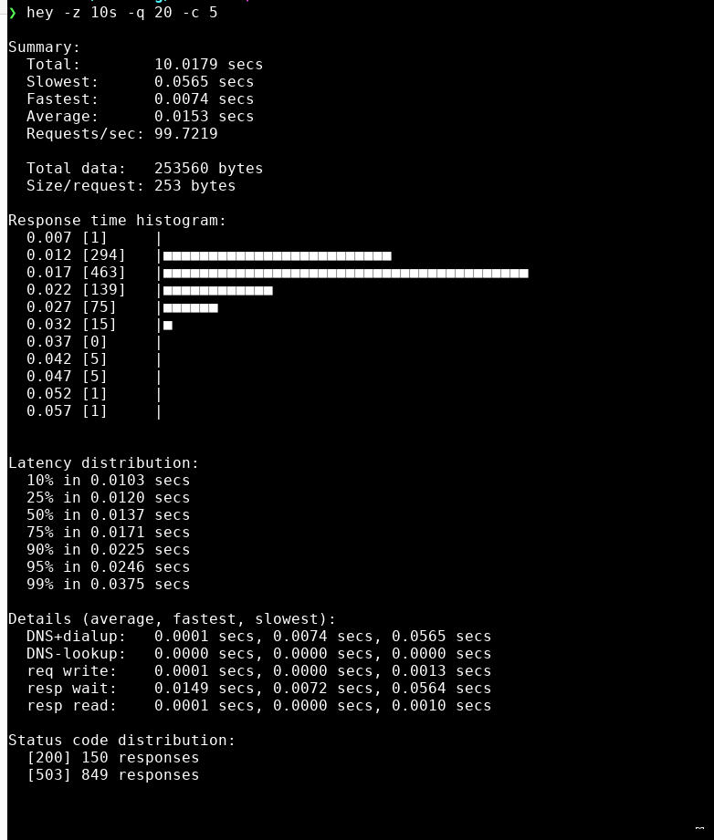

# foodinfra_homelab

Infrastructure for **foodapplication_homelab**.  
Uses a k3s cluster to deploy all resources.  

## Purpose

This project is a playground for me to practice Kubernetes.  

I also did some experiments with DDoS - I'm using `hey` to send a large number of requests to NGINX Ingress controller (in which I've already set rate-limit)

